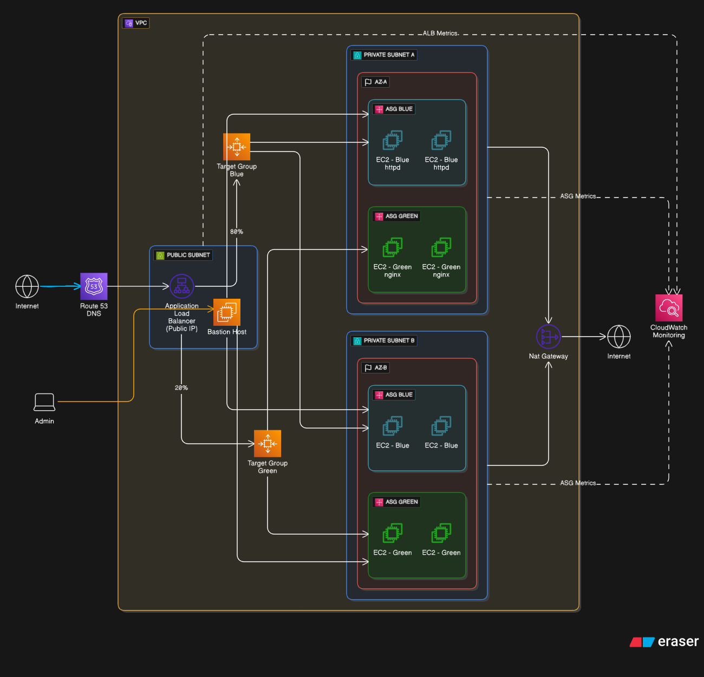

# **Blue/Green Deployment on AWS — Terraform Infrastructure**

This repository contains the complete Terraform code and architecture diagram used to deploy a fully automated **Blue/Green Deployment infrastructure** on Amazon Web Services (AWS). The project demonstrates a scalable, highly available, and reproducible environment designed for seamless application version transitions, fault tolerance, and operational efficiency.

---

## **📘 Overview**

The goal of this project is to provide a production-ready setup for Blue/Green deployments using AWS managed services and Infrastructure-as-Code. The entire environment can be deployed or destroyed in minutes via Terraform, ensuring cost efficiency and easy iteration.

The infrastructure includes:

* **Custom VPC** with isolated **public** and **private subnets** across two Availability Zones
* **Application Load Balancer (ALB)** balancing traffic between Blue and Green target groups
* **Auto Scaling Groups (ASG)** for both Blue (Apache) and Green (Nginx) environments
* **User Data automation** for installing and configuring Apache/Nginx
* **Bastion Host** for secure SSH access into the private subnets
* **NAT Gateway** enabling outbound Internet access for private instances
* **Security Groups** enforcing strict network segmentation

All components are modular, scalable, and defined using Terraform.

---

## **🧱 Architecture**



---

## **📦 Repository Structure**

```
.
├── alb.tf                 # ALB + listeners + target groups
├── bastion.tf             # Bastion host in public subnet
├── ec2_asg.tf             # Blue/Green Auto Scaling Groups + Launch Templates
├── vpc.tf                 # VPC, subnets, IGW, NAT, routing
├── security_groups.tf     # Security groups for ALB, EC2, Bastion
├── route_table.tf         # Public and private route tables
├── main.tf                # Terraform provider + global configuration
├── architecture.png       # Architecture diagram
└── README.md              # Documentation
```

---

## **🚀 Deployment**

### **Prerequisites**

* Terraform ≥ 1.4
* AWS CLI configured with valid credentials
* An AWS account

### **Deploy the Infrastructure**

```sh
terraform init
terraform plan
terraform apply
```

Terraform will provision the full Blue/Green environment automatically.

### **Destroy the Infrastructure**

To prevent any unexpected AWS charges:

```sh
terraform destroy
```

This removes all deployed resources safely.

---

## **🧪 Validation & Testing**

Once deployed:

### **Load Balancing Test**

* Access the DNS name of the ALB (outputted by Terraform)
* Refresh multiple times
* You should see:

  * Apache (Blue) instances most of the time
  * Nginx (Green) instances occasionally (based on weighted routing)

### **Failover Test**

* Terminate one EC2 instance from the AWS console
* The ASG will automatically:

  * Launch a replacement instance
  * Register it in the target group
  * Pass health checks and return it to "healthy" status

---

## **🔐 Security Considerations**

* Private EC2 instances **do not** have public IPs
* SSH access is only allowed through the Bastion Host
* Egress rules are restricted and NATed
* ALB only exposes necessary ports (HTTP/HTTPS)

---

## **🛠 Technologies Used**

* **Terraform** (Infrastructure as Code)
* **AWS VPC, EC2, ALB, ASG, Target Groups**
* **Amazon Linux 2**
* **Apache / Nginx**
* **NAT Gateway + Bastion Host**

---

## **📄 License**

This project is released under the MIT License.
Feel free to fork, modify, and reuse for your own infrastructure.
